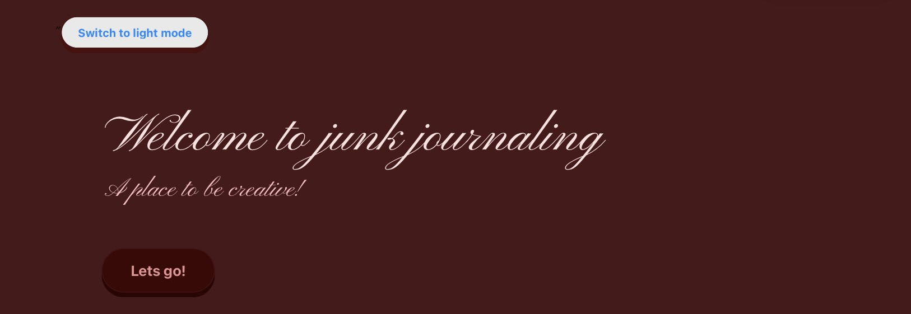

<h1><b>Junk Journaling </b></h1>

<i>I've created a website where you can junk journal and be creative without the restrictions of lack of materials or if you are in an artist bloc.</i>

<h2><b>Here is a screenshot of my main page </b></h2>

<h2><b>Tech Stack!</b><h2>

<i>the languages I used were: </i>

<b>HTML</b>

<b>CSS</b>

<b>JavaScript
</b>

<h2><b>How to run it!</b></h2>
<link href="https://be4utywseel.github.io/junk-journal/" >

<i>You will be directed to the main page where you can switch the theme, an interactive button on the bottom of the page will direct you to the next page where you can also change the theme, its currently under progress. </i>

<h2><b>AI usage and learning languages </b></h2>

<i>For HTML, CSS and JavaScript, I researched codes on websites for teaching coding and watched a couple of youtube videos, Ai was not used yet but might be used in the future. </i>

[def]: MG_2047.PN